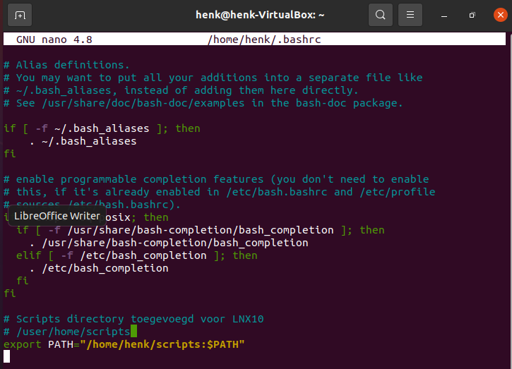
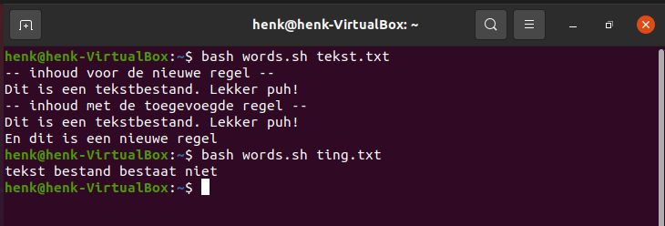
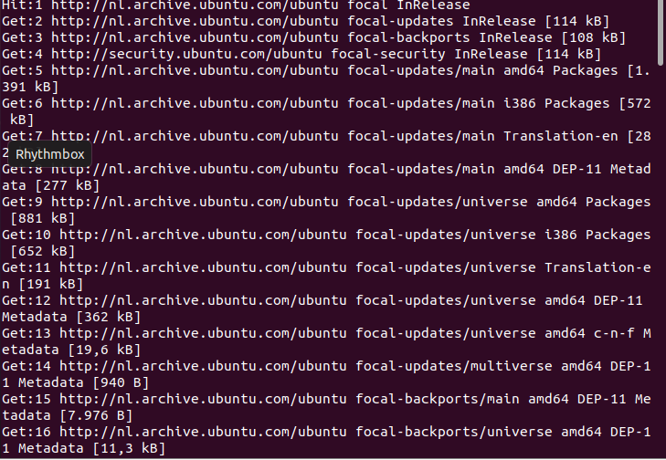
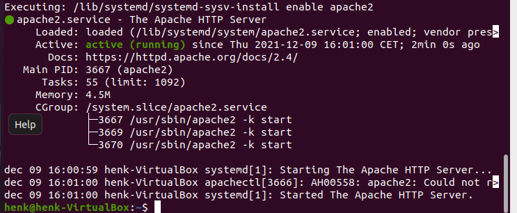
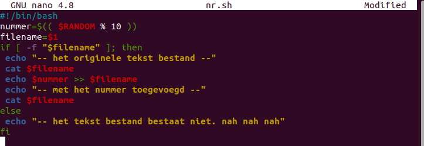
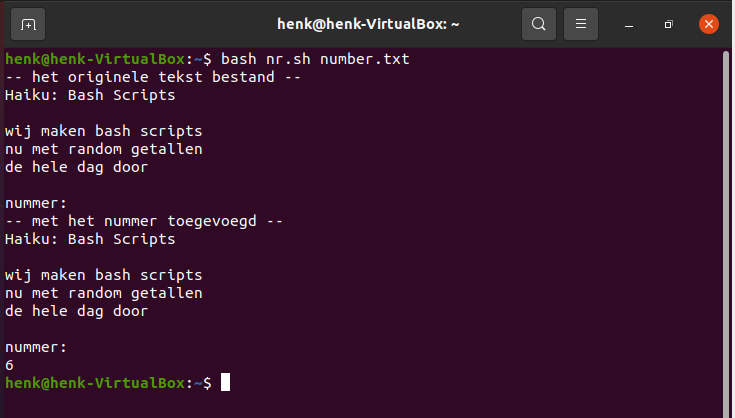

# Bash scripting
Bash scripting is een manier om meerdere commandos die je wilt uitvoeren in een bestand op te nemen. Dit bestand kun je dan uitvoeren, zodat alle commandos uitgevoert worden.

## Key-terms
- Bash scripting: Bash scripting is een manier om te automatiseren d.m.v. scrips. Je kunt het vergelijken met Windows Batch (of voor de ouderen onder ons MS-DOS). 
- Nano: Dit een tekst editor. Je kunt bestanden aanmaken en die vullen met informatie. Of in dit geval met commando's.
- PATH variable: De Path variable ($PATH) specificeert een set van directories waar uitvoerbare programma's te vinden zijn. Dit zorgt ervoor dat software applicaties veel voorkomende programma's kan benaderen.
- httpd: Apche server om website op te kunnen draaien

## Opdracht
Opdracht 1:  
1. Maak een directory met de naam 'scripts'. Plaats alle scripts die je gaat maken in deze directoy.
2. Voeg de scripts directory toe aan de PATH variable.  
3. Maak een script die een regel tekst toevoegt aan een tekst bestand, zodra het script wordt gestart.  
4. Maak een script die de httpd package installeert, httpd activeert, httpd enabled en de status van httpd in de terminal laat zien.

Opdracht 2:
1. Maak een script dat een willekeurig nummer genereert tussen 1 en 10, het opslaat in een variabele en het nummer toevoegt aan een tekst bestand.

### Gebruikte bronnen
Bash scripting - https://help.ubuntu.com/community/Beginners/BashScripting  
30 voorbeelden - https://linuxhint.com/30_bash_script_examples/  
How to install httpd - https://ubuntu.com/tutorials/install-and-configure-apache#3-creating-your-own-website  

### Ervaren problemen
[Geef een korte beschrijving van de problemen waar je tegenaan bent gelopen met je gevonden oplossing.]

### Resultaat
**OPDRACHT 1**  
1.1. Directory aangemaakt met de naam 'scripts'  
  

1.2. De scripts directory toevoegen aan de PATH variable (ik het de permanente optie gekozen) en het is tevens gecontroleerd  
  

  

  

1.3. M.b.v. Nano een tekstbestand gemaakt (tekst.txt). Daarna een script gemaakt die controleert of het bestand aanwezig is en zo ja het script verder uitvoert. Anders de melding dat het tekst bestand niet bestaat.  
Twee controles gedaan. 1. met een bestaand bestand. 2. met een niet bestaand bestand.  

  

  

  

1.4. Ik heb m.b.v. nano een script gemaakt waarin Apache wordt geïnstalleerd, activeert, enabled en de status weergeeft.  

  

  

  

N.B. In het script zit nog een moment waarbij een handmatige actie is vereist. Dat heb ik hersteld door de regel met 'sudo apt install...' aan te passen: sudo apt -y install apache2.  

**OPDRACHT 2**  
Ik heb eerst een tekst bestand aangemaakt, zodat ik een getal kan toevoegen.  

  

Daarna heb ik het bash script geschreven. Met controle of het gevraagde tekst bestand ook bestaat. Indien niet: dan een passende melding.  

  

Hier de uitvoer met bestaand tekst bestand:  
  

Hier de uitvoer met niet bestaand tekst bestand:  
  