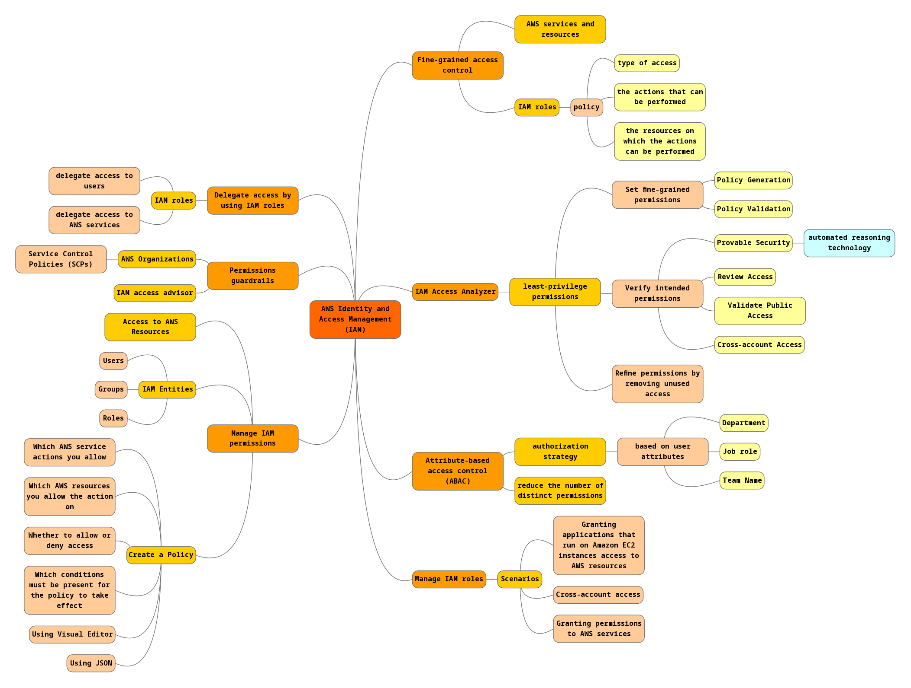

# Identity and Access Management (IAM)
Het staat voor Identity and Access Management en is de service die de toegang tot AWS-bronnen regelt. Aangezien toegang tot bronnen een van de meest elementaire dingen is die je op AWS kunt doen, is dit één van de belangrijkste onderwerpen.

IAM is gebasseerd op 3 elementen:  
1. **Resources** zijn de entiteiten die je in AWS maakt. Dit kan zoiets zijn als een S3-bucket, een S3-object of DynamoDB-tabellen. Alle bronnen in AWS worden vertegenwoordigd door iets dat een ARN- of Amazon-bronnaam wordt genoemd. Je hebt waarschijnlijk een van deze identifiers eerder gezien, ze zien er een beetje zo uit:  
*arn:aws:s3:::test-website-awssimplified*.  
1. **Actions** zijn de bewerkingen die gebruikers proberen uit te voeren op resources. Als ik bijvoorbeeld een lambda-functie heb gemaakt, wil ik misschien de configuratie bijwerken. Om dat te doen, moet ik een API gebruiken met de naam lambda:UpdateFunctionConfiguration. Om deze actie uit te voeren, moet ik toestemming hebben om deze API aan te roepen. Maar hoe krijg ik toestemmingen?  
Het antwoord ligt in de Policy...  
3. **Policy/Policy Document** Het hart van AWS IAM is de Policy. IAM-Policy verwijst naar specifieke JSON-documentatie die gebruikersmachtigingen definiëren voor toegang tot een resource. Met andere woorden, de autorisatie om een *Action* uit te voeren wordt bepaald door het al dan niet beschikken over het juiste policy document met bijbehorende rechten.  

## IAM Pro Tips
- Protect your **Root Account** at all cost
- Explicit **Effect:Deny** wins over **Effect:Allow**
- Use the **Least Privilege Model**
- Use the **Policy Simulator**

Voorbeeld van een Policy statement: DynamoDB tabel met Read-Only-Access voor specifieke kolommen.  

**Sid** = de naam van het Policy Statement  
**Effect** = Allow or Deny  
**Action** = Wat er wel of niet mag (*=wildcard)  
**Resource** = in dit geval de DynamoDB met specifieke tabel  
**Condition** = Voorwaarden en attributen

Ik heb een mindmap gemaakt van de features van IAM:  

### Samengevat
We create **users** who use **credentials** that grant access based on their **policy document**

We create **Roles** which can be assumed by **entities** within or across account boundaries with a **trust relationship**

#### Trust Relationship
In de afbeelding hieronder een weergave van een **trust relationship**.  
*Account 1* heeft toegang tot de DynamoDB tabel. *Account 2* wil graag toegang tot deze tabel hebben. Om dat te realiseren moet er een *Role* gemaakt worden met de juiste permissies.

Vervolgens moet er via IAM een trust relation gecreërd worden. Hierin geeft *Account 1* dat deze *Account 2* vertrouwd en vice versa.  
Daarnaast geeft *Account 1* de mogelijkheid aan *Account 2* om de rol aan te nemen: *Assumed Role*.  
Hierdoor krijgt *Account 2* toegang tot de tabel.  

## Key-terms
- Alle key-terms die betrekking hebben op AWS Cloud Practitioner, zijn te vinden in het document: [AWS-Cloud-Practitioner](../beschrijvingen/aws-cloud-practitioner.md)  

## Opdracht
[Introduction to AWS Identity and Access Management (IAM)](https://amazon.qwiklabs.com/focuses/22172?catalog_rank=%7B%22rank%22%3A2%2C%22num_filters%22%3A0%2C%22has_search%22%3Atrue%7D&parent=catalog&search_id=15177031)
### Gebruikte bronnen
- https://aws.amazon.com/iam/?nc=sn&loc=1
- https://www.youtube.com/watch?v=_ZCTvmaPgao

### Ervaren problemen
Geen

### Resultaat
[Omschrijf hoe je weet dat je opdracht gelukt is (gebruik screenshots waar nodig).]
